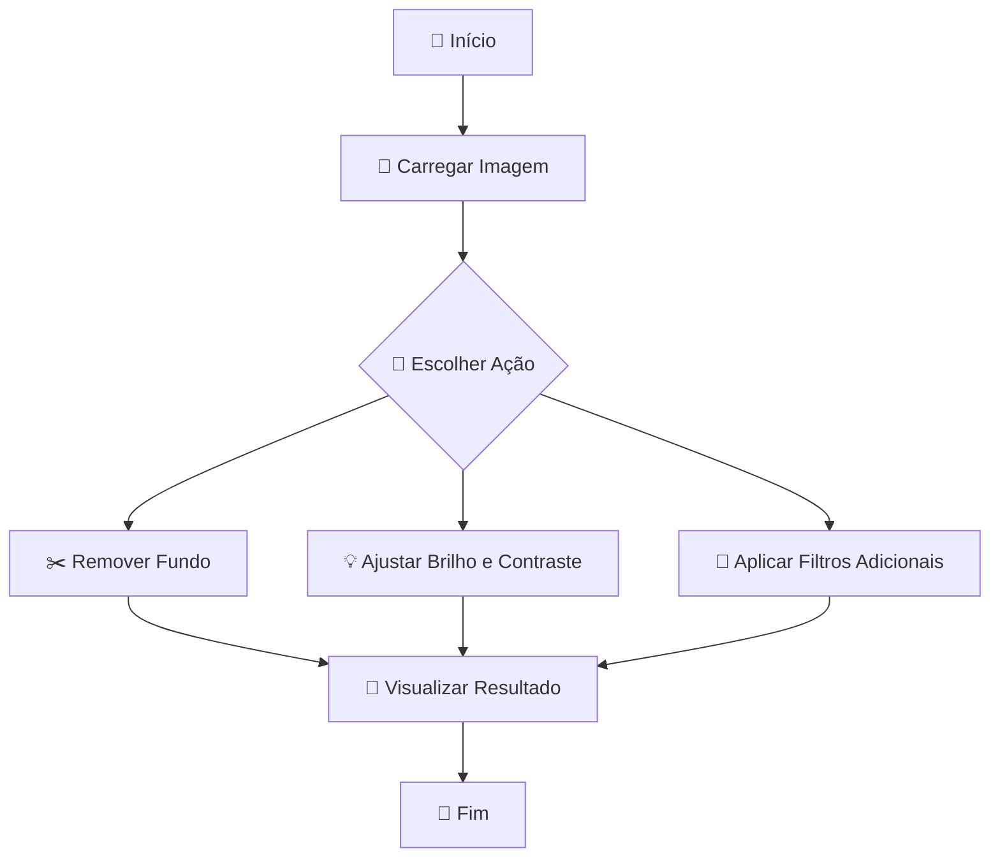

# QuickMedia 🚀✨

QuickMedia é um projeto que oferece uma plataforma integrada de serviços multimídia 🎥🎶, como remoção de fundo de imagens 🖼️, download de vídeos 📥 e áudios 🎧, conversão de formatos de arquivos 🔄, separação de áudio 🔊 e muito mais. O projeto está em constante desenvolvimento 🔄 e, atualmente, começamos com a funcionalidade de remoção de fundo de imagens ✂️, acessível através da interface “app.py”. Novas funcionalidades serão adicionadas ao aplicativo em futuras atualizações ⏳.

## 🛠️ Tecnologias Utilizadas

- 🐍 **Python 3**: Linguagem principal do projeto.
- 🌐 **Streamlit**: Utilizado para a criação da interface do usuário.
- ✨ **OpenCV**: Biblioteca para processamento de imagem 🖼️ (ajustes de brilho e contraste).
- 🖼️ **Pillow**: Utilizado para manipulação de imagens.
- ✂️ **rembg**: Biblioteca usada para a remoção do fundo das imagens.

## ⚙️ Funcionalidades

- **Remoção de Fundo de Imagem** ✂️: Carregue uma imagem 🖼️ e remova o fundo de forma rápida e eficaz ⚡.
- **Ajuste de Brilho e Contraste** 💡: Controle o brilho ☀️ e contraste da imagem de forma automática 🤖.
- **Ajuste de Nitidez e Saturação** 🔍🎨: Aplique melhorias na nitidez e na cor da imagem 🌈.
- **Filtros Adicionais** 🎨: Converta a imagem para tons de cinza ⚫⚪ ou aplique fundo verde (chroma key) 💚.
- **Interface de Processamento em Tempo Real** ⏱️: Visualize a imagem original e processada lado a lado 👀 para comparar os resultados.

## ▶️ Como Executar o Projeto

1. Clone este repositório:

   ```bash
   git clone https://github.com/seu-usuario/QuickMedia.git
   ```

2. Navegue até o diretório do projeto:

   ```bash
   cd QuickMedia
   ```

3. Instale as dependências necessárias 📦:

   ```bash
   pip install -r requirements.txt
   ```

4. Execute o script principal 🖥️:

   ```bash
   streamlit run app.py
   ```

5. A interface do usuário será aberta no seu navegador 🌐, onde você poderá carregar imagens 🖼️ e aplicar as funcionalidades disponíveis.

## 📝 Estrutura do Código

- **app.py**: Arquivo principal que cria a interface do usuário utilizando Streamlit. Permite ao usuário carregar uma imagem, ajustar os parâmetros e visualizar a imagem processada em tempo real ⏱️.
- **image_processing.py**: Contém as funções de processamento de imagem 🖼️, como remoção de fundo ✂️, ajuste de brilho 💡 e contraste, aplicação de filtros adicionais 🎨, entre outros.
- **app.log** e **processing.log**: Arquivos de log 📜 para registrar erros ❌ e auxiliar no debug 🐞.

## 📊 Fluxograma



## 🤝 Contribuição

Se você quiser contribuir com este projeto 💡:

1. Faça um fork do projeto 🍴.
2. Crie uma nova branch para a sua funcionalidade (`git checkout -b nova-funcionalidade`).
3. Commit suas alterações (`git commit -am 'Adiciona nova funcionalidade'`).
4. Envie para a branch (`git push origin nova-funcionalidade`).
5. Abra um Pull Request 🚀.

## 📜 Licença

Este projeto está sob a licença MIT. Veja o arquivo [LICENSE](LICENSE) para mais detalhes.